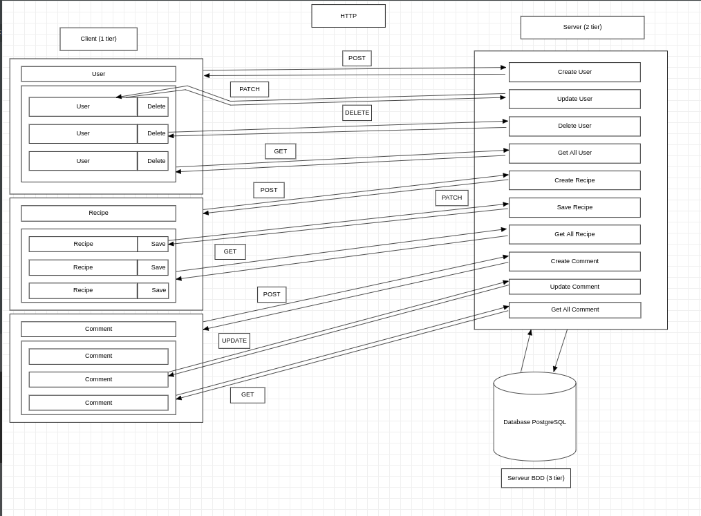

<h1 align="center">Welcome to Brief N Tiers 👋</h1>

  

> Our mission is the initialization of the application using the N Tiers architecture by applying it to our common thread project.

> The Project must respect the rules of development with the N Tiers architecture.

## Architecture diagram
* N Tiers diagram: 
  
  

## UseCase diagram
* UseCase diagram: 
  
  

## Sequences diagram
* Sequence login diagram: 
  
  

## Class diagram
* Class diagram: 
  under review

## Technology choice table
* Questioning technology: 
  
  

* Technology comparison:
  

## Link of Jira
[**Jira-Cuistonaute**](https://team-1637591819304.atlassian.net/jira/software/projects/FRC/boards/2/roadmap) 

## Authors

👤 [**MocquaisChristopher**](https://github.com/mocquaischristopher) 
👤 [**DannyPoizot**](https://github.com/DannyPoizot)

## Show your support

Give a ⭐️ if this project helped you!

***
_This README was generated with ❤️ by [readme-md-generator](https://github.com/kefranabg/readme-md-generator)_
