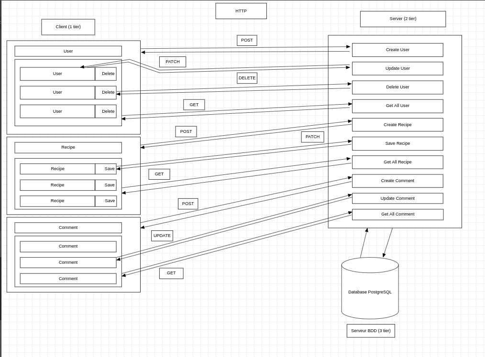

#  
 Schéma de l'architecture 3 tiers 
 

## Voici le schéma de l'architecture 3 tiers utilisée dans le projet Cuistonaute. 

Le tiers 1, le client qui correspondra au navigateur, avec toutes les interactions possibles pour l'utilisateur.

Le tiers 2, la partie serveur qui correspondra à la relation entre le client et la base de données, qui contient toutes les routes et suivant là où l'utilisateur veut se rendre, lui renvoie la bonne page.

Le tiers 3, qui correspond à la base de données qui contient toutes les informations de l'application.
 

## Schema 3 tiers

